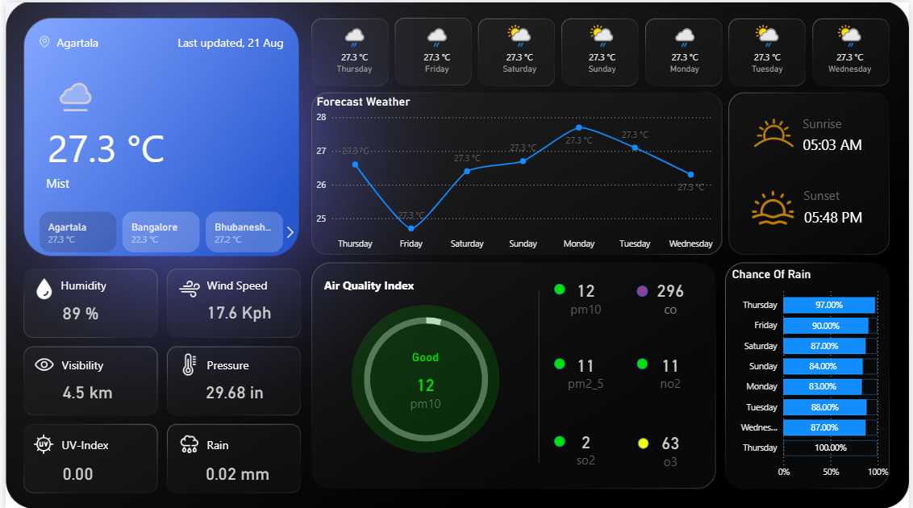

# 🌦️ Weather Forecast Dashboard (Power BI)

This project is a **Weather Forecast Dashboard** built in **Power BI**, using real-time weather data fetched from **[WeatherAPI.com](https://www.weatherapi.com/)**.  
It visualizes weather conditions, air quality, sunrise/sunset timings, and rain probabilities for different locations across India.  



---

## 📌 Features  

- 🌍 **Multi-location Weather Monitoring** – Shows weather conditions for Agartala, Bangalore, Bhubaneswar, and more.  
- 🌡️ **Current Weather Overview** – Displays temperature, mist/cloud condition, humidity, wind speed, visibility, and pressure.  
- 📈 **Forecast Chart** – 7-day temperature forecast visualization.  
- 🌅 **Sunrise & Sunset Times** – Daily timings included.  
- 🍃 **Air Quality Index (AQI)** – PM10, PM2.5, CO, NO2, SO2, and O3 levels shown with AQI status.  
- ☔ **Rain Probability** – Daily percentage chance of rain for the coming week.  
- 🎨 **Interactive & Responsive Dashboard** – User-friendly interface with clean design.  

---

## 🛠️ Tech Stack  

- **Power BI** – Dashboard development & visualization.  
- **WeatherAPI.com** – Data source (API key required).  
- **Data Transformation** – Power Query used for shaping data.  
- **DAX** – Measures and calculations for visualization.  

---

## 🚀 Getting Started  

### 1️⃣ Clone Repository  
```bash
git clone https://github.com/ajantaGhost/PowerBI_Weather_Dashboard.git
cd Weather_Forecast_Dashboard
```

### 2️⃣ Get API Key  
- Sign up at [WeatherAPI.com](https://www.weatherapi.com/).  
- Generate your free **API Key**.  

### 3️⃣ Connect Power BI with API  
- Open the `.pbix` file in **Power BI Desktop**.  
- In **Power Query**, replace the placeholder API key with your own:  
  ``` 
  https://api.weatherapi.com/v1/forecast.json?key=YOUR_API_KEY&q=LOCATION&days=7
  ```

### 4️⃣ Load Data  
- Refresh the dataset in Power BI.  
- Explore the weather dashboard!  

---

## 📊 Example Insights  

- **Agartala (21 Aug)** – 27.3°C, Mist, 89% humidity, AQI: Good (12).  
- **Rain Probability** – 97% on Thursday, 90% on Friday, decreasing slightly over the week.  

---

## 📂 Project Structure  

```
├── WeatherDashboard.pbix       # Power BI dashboard file
├── WeatherDashboard.png        # Dashboard preview
├── README.md                   # Documentation
```

---

## 📌 Future Enhancements  

- Add **more Indian cities** dynamically.  
- Include **historical weather trends**.  
- Integrate with **real-time refresh** using Power BI Gateway.  
- Add **severe weather alerts**.  

---

## 📜 License  

This project is licensed under the **MIT License**.  

---

✨ Built with ❤️ using **Power BI** and **WeatherAPI.com**
